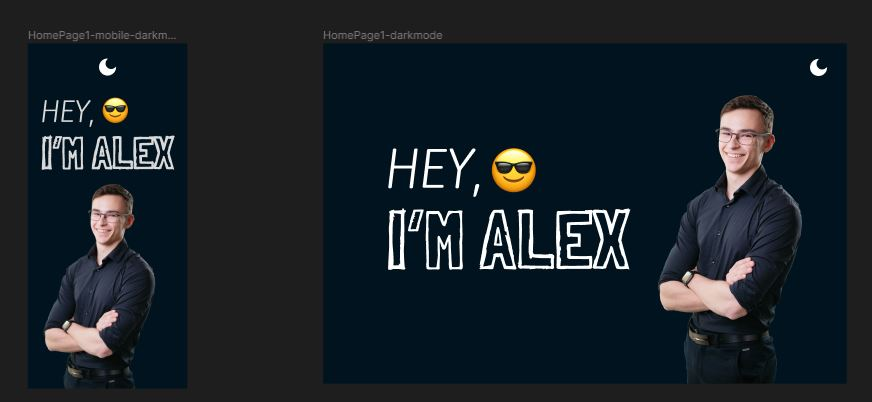
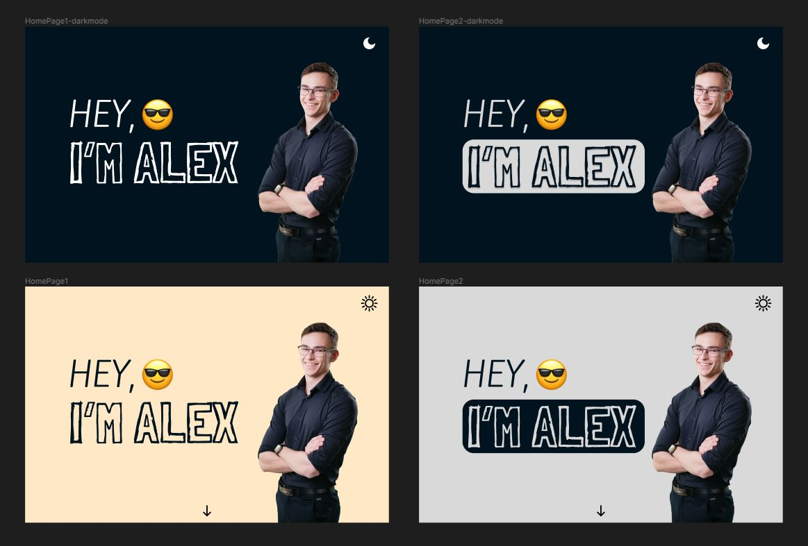
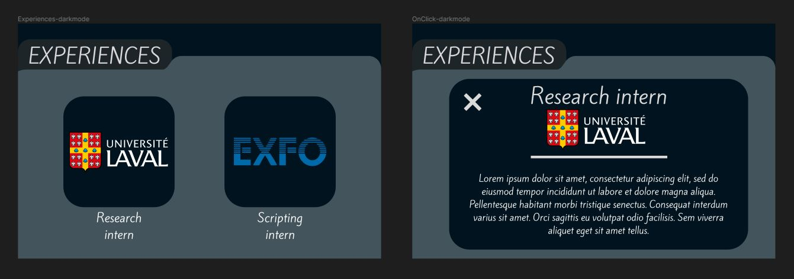

# Portfolio

This is a portfolio website built with Next.js/React and Tailwind CSS that showcases my past experiences and some projects I am proud of.

## Getting Started

First, install dependencies:

```bash
npm install
```

Then, run the development server:

```bash
npm run dev
```

Open [http://localhost:3000](http://localhost:3000) with your browser to see the result.

## Design Process

First of all, I wanted to make sure that the website was responsive, so I used Tailwind CSS to make sure that the website was responsive on all devices. Based on this idea, I started to design the website with a Mobile First Design.



I like designing websites which also leads to multiple designs.



Also, I knew I wanted a simple websites. When I visit a portfolio website, I know that I do not like having to change pages constantly. Based on this, I built a single page website where everything is on the home page, and if more information is needed, it is shown in a modal. This idea can be seen in the "Experiences" section of the site.



## Challenges I encountered

### Next.js

Making a light/dark mode for the site ended up being a little more complicated than expected. For the folder in experiences, I decided to use a .png image for the light mode and another for the dark mode (instead of building the folder using css and applying dark mode style to it using tailwind directly). This lead to hydration problems when switching between light and dark mode and then closing and reopening the site. The site was displaying on the client before the theme could be updated server side, which led to an hydration problem. I ended up having to add code to prevent the display of the component before the local storage theme could be read.

### Responsive Design

Using an image for the folder like I mentioned before really made this part more complicated. If I were to redo it, I would have used CSS to build the folder, even if that was more difficult at first, I would have saved time later.
